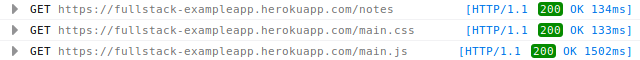
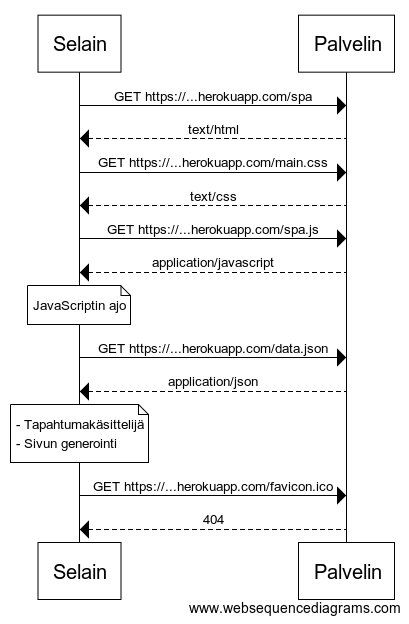
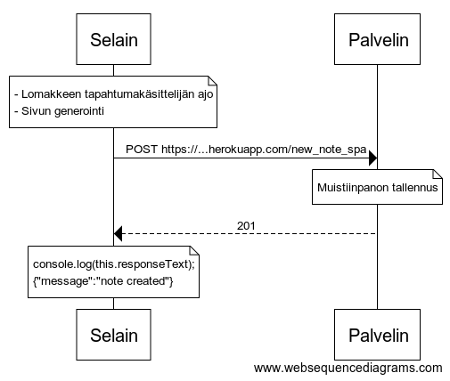

# Osa 0 - Tehtävät

## Uusi Muistiinpano

Kun tallennusnappia painetaan, sivun lomake lähettää syötetyn tekstin POST
metodilla palvelimelle osoitteeseen *new_note*, mikä on itseasiassa skripti.

Se tallentaa tekstin ja luomisajan taulukkoon, mutta mielestäni kuvauksesta
puuttuu jotain. En ihan täysin ymmärrä missä kohtaa syötetty teksti lisätään
raakadatasta generoituun listaan. Tallennetaanko taulukko ja raakadata
johonkin tilapäiseen *data.json* tiedostoon?

Joka tapauksessa, skriptin ajon jälkeen, palvelin palauttaa selaimelle 302
Redirect tunnisteen mikä kertoo selaimelle että sen tulisi ladata
vastausheaderin Location kentän välittämä osoite.


Meidän tapauksessamme välitetty osoite on alkuperäinen sivu, joka siis
latautuu uudestaan liitetiedostoineen GET metodilla.



Selaimessa suoritettavan JavaScriptin (main.js) tapahtumakäsittelijä
käynnistyy koska sivun tila on muuttunut.


Tapahtumakäsittelijä parsii JSON tiedoston ja generoi sen sisällöstä sivulle
järjestämättömän listaelementin.

```javascript
var xhttp = new XMLHttpRequest();

xhttp.onreadystatechange = function () {

	/* Tarkistetaan että sivu on latautunut ja tila DONE */
	if (this.readyState == 4 && this.status == 200) {

		/* Parsitaan JSON tiedosto */
		const data = JSON.parse(this.responseText);
		console.log(data);

		var ul = document.createElement("ul");
		ul.setAttribute("class", "notes");

		/* Luodaan uusi listaelementti jokaiselle tietueelle */
		data.forEach(function(note){
			var li = document.createElement("li");

			ul.appendChild(li);
			li.appendChild(document.createTextNode(note.content));
		})

		/* Lisätään elementti HTML dokumenttiin */
		document.getElementById("notes").appendChild(ul);
	}
}

xhttp.open("GET", "/data.json", true);
xhttp.send();
```

## Single Page App



## Uusi muistiinpano - Diagrammi


